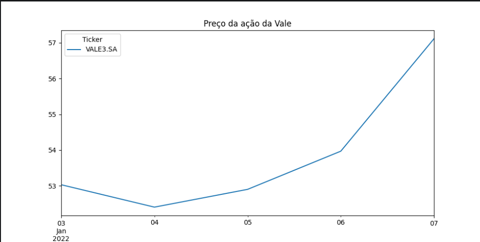
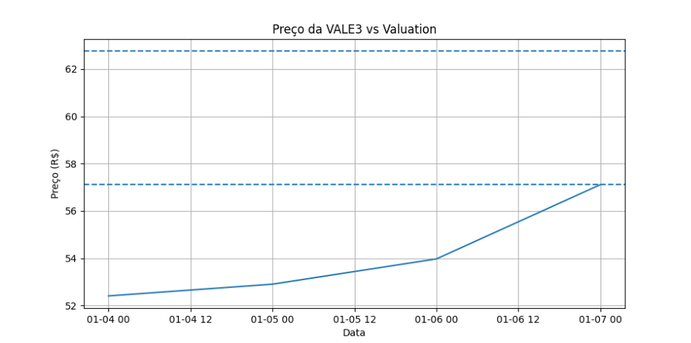

# Valuation Simples - VALE3

Projeto de análise de dados aplicado ao mercado financeiro, com foco na construção de um modelo simples de valuation da ação VALE3 utilizando Python e Power BI.

## Objetivo

Desenvolver uma análise inicial da ação VALE3 a partir de dados históricos, estimando um preço justo com base no retorno médio e apresentando os resultados de forma visual.

## Ferramentas utilizadas

* Python
* Pandas
* yFinance
* Matplotlib
* Power BI

## Etapas do projeto

1. Coleta de dados históricos da ação VALE3 via API
2. Tratamento e limpeza dos dados
3. Cálculo do retorno diário
4. Estimativa de retorno médio
5. Projeção de preço justo (valuation simples)
6. Visualização gráfica no Python
7. Construção de dashboard no Power BI
   
## Visualizações

### Gráfico no Python

Visualização da série histórica da ação com indicação do preço justo estimado.

### Dashboard no Power BI

Dashboard interativo com análise do preço da ação e comparação com o preço justo estimado.

## Exemplo de código

import yfinance as yf
import pandas as pd

vale = yf.download('VALE3.SA', start='2022-01-01', auto_adjust=True)

vale['retorno'] = vale['Close'].pct_change()
vale = vale.dropna()

retorno_medio = vale['retorno'].mean()
preco_atual = vale['Close'].iloc[-1]

dias = 5
preco_justo = preco_atual * (1 + retorno_medio) ** dias

## Estrutura do projeto

vale-valuation/
│
├── data/
│   └── vale_valuation.csv
│
├── src/
│   └── valuation.py
│
├── dashboard/
│   └── vale_dashboard.pbix
│
├── images/
│   ├── grafico_python.png
│   └── dashboard_powerbi.png
│
└── README.md

## Limitações do modelo

Este projeto usa de um modelo simplificado de valuation baseado apenas em retorno histórico de curto prazo.

Não considera fundamentos importantes como:

* Fluxo de caixa
* Lucro da empresa
* Endividamento
* Cenário macroeconômico

## Conclusão

Este projeto apresenta uma abordagem inicial de valuation e análise de ativos, com foco no aprendizado prático e no desenvolvimento de portfólio voltado ao mercado financeiro.

## Contato

Caso queira trocar ideias sobre o projeto ou oportunidades na área de dados e investimentos, fique à vontade para se conectar.

